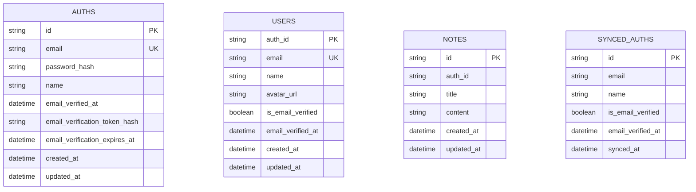

# Database Design

This project uses PostgreSQL + Prisma with a strict database-per-service model.

## Database Per Service

- `auth-service` owns `auth_service_db`
- `user-service` owns `user_service_db`
- `note-service` owns `note_service_db`

Services do not query each other's tables directly. Data propagation happens through RabbitMQ events.

## Virtual DB Topology

```mermaid
graph LR
  A[auth-service] --> ADB[(auth_service_db)]
  U[user-service] --> UDB[(user_service_db)]
  N[note-service] --> NDB[(note_service_db)]

  ADB -. auth.created / auth.email_verified .-> UDB
  UDB -. user.created / user.email_verified .-> NDB
```

## ER View (Logical)



## Prisma Models by Service

`auth-service/prisma/schema.prisma`

- `Auth` (`@@map("auths")`)

`user-service/prisma/schema.prisma`

- `User` (`@@map("users")`, `id` mapped to `auth_id`)

`note-service/prisma/schema.prisma`

- `Note` (`@@map("notes")`)
- `SyncedAuth` (`@@map("synced_auths")`)

## Important Constraint

`Note.auth_id` and `SyncedAuth.id` represent IDs from upstream services, but they are not cross-database foreign keys. This is intentional for microservice isolation.

## Docker DB Mapping

| Service DB | Container | Host Port | DB Name |
| --- | --- | --- | --- |
| Auth DB | `auth-db` | `5433` | `auth_service_db` |
| Note DB | `note-db` | `5434` | `note_service_db` |
| User DB | `user-db` | `5435` | `user_service_db` |

