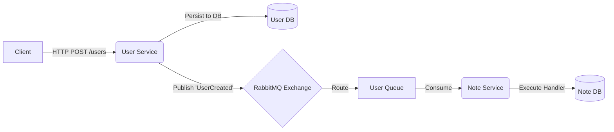

# Folder Structure of Even Driven Architecture 

[](https://nodejs.org/)
[](https://www.typescriptlang.org/)
[](https://www.docker.com/)
[](https://www.rabbitmq.com/)


<h3>🛠 Tech Stack ⚛</h3>

---

<p align="center">
  
  
  
  
  
  
  
  
  
  
  
  
  
  
</p>

---

<div align="center">
  <h2>Micro Service Architecture</h2>
  
</div>

A scalable, event-driven microservices architecture built with **Node.js** and **TypeScript**. This project demonstrates asynchronous communication between services using **RabbitMQ** to decouple business logic and ensure high availability.

---

## 🏗 System Architecture

The application is split into distinct domain services. Communication is handled via REST APIs for synchronous operations and RabbitMQ for asynchronous event propagation.


### The Flow
1.  **User Service**: Handles user authentication and management. When a user state changes (e.g., created, updated), it **publishes** an event to the message broker.
2.  **RabbitMQ**: Acts as the message broker, routing events to the appropriate queues.
3.  **Note Service**: Manages user notes. It **consumes** user events to maintain data consistency (e.g., creating a default welcome note when a new user registers).


```
app/
│
├── docker-compose.yml
│
├── user-service/
│   ├── package.json
│   ├── tsconfig.json
│   └── src/
│       ├── app.ts
│       ├── server.ts
│       │
│       ├── config/
│       │   ├── env.ts
│       │   └── rabbitmq.ts
│       │
│       ├── modules/
│       │   └── user/
│       │       ├── user.controller.ts
│       │       ├── user.service.ts
│       │       ├── user.model.ts
│       │       ├── user.routes.ts
│       │       └── user.events.ts
│       │
│       ├── events/
│       │   ├── publishers/
│       │   │   └── user.publisher.ts
│       │   └── types/
│       │       └── user.events.types.ts
│       │
│       └── shared/
│           ├── database.ts
│           └── logger.ts
│
└── note-service/
    ├── package.json
    ├── tsconfig.json
    └── src/
        ├── app.ts
        ├── server.ts
        │
        ├── config/
        │   ├── env.ts
        │   └── rabbitmq.ts
        │
        ├── modules/
        │   └── note/
        │       ├── note.controller.ts
        │       ├── note.service.ts
        │       ├── note.model.ts
        │       └── note.routes.ts
        │
        ├── events/
        │   ├── consumers/
        │   │   └── user.consumer.ts
        │   └── handlers/
        │       └── user.event.handler.ts
        │
        └── shared/
            ├── database.ts
            └── logger.ts
```
---