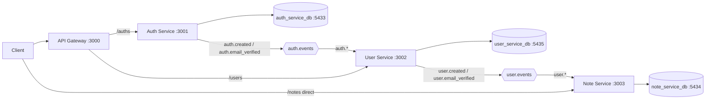
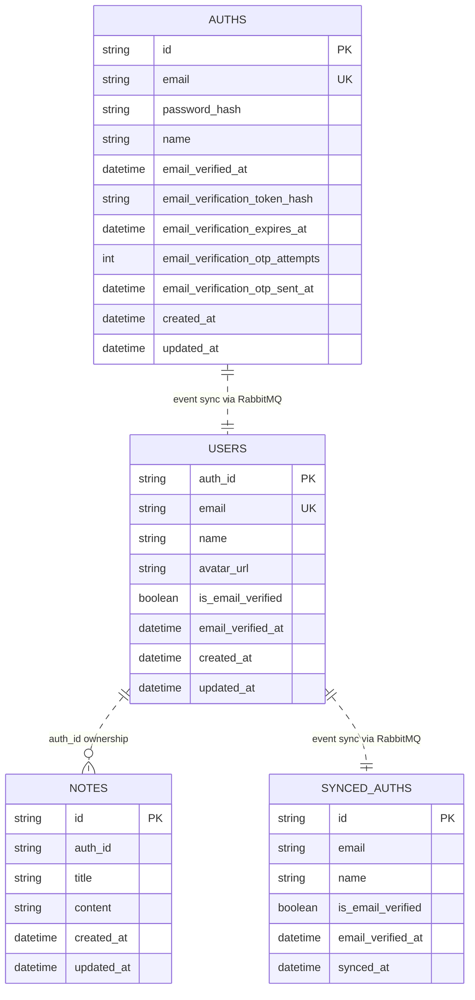

# Event-Driven Microservices with RabbitMQ

This repository implements a Node.js + TypeScript event-driven architecture with:

- `auth-service`
- `user-service`
- `note-service`
- `api-gateway`
- RabbitMQ
- PostgreSQL (database-per-service)

The current implementation is:

- `auth-service` publishes `auth.created` and `auth.email_verified`
- `user-service` consumes auth events, syncs local users, then publishes `user.created` and `user.email_verified`
- `note-service` consumes user events, syncs `SyncedAuth`, and creates a welcome note on `user.created`
- `api-gateway` proxies only `/auths` and `/users`

## Architecture



## Virtual DB Diagram

This is the logical (virtual) DB view from your running code.



Notes:

- There are no cross-database foreign keys between services.
- `user-service.User.id` maps to `auth_id` and uses the same UUID produced by `auth-service`.
- `note-service.Note.auth_id` is a plain column, not a DB FK to another service DB.

## Services and Ports

| Component      | Container/Service | Host Port | Internal Port |
| --- | --- | --- | --- |
| API Gateway    | `api-gateway` | `3000` | `3000` |
| Auth Service   | `auth-service` | `3001` | `3001` |
| User Service   | `user-service` | `3002` | `3002` |
| Note Service   | `note-service` | `3003` | `3003` |
| RabbitMQ AMQP  | `rabbitmq` | `5672` | `5672` |
| RabbitMQ UI    | `rabbitmq` | `15672` | `15672` |
| Auth DB        | `auth-db` | `5433` | `5432` |
| Note DB        | `note-db` | `5434` | `5432` |
| User DB        | `user-db` | `5435` | `5432` |

## API Endpoints (Current)

Gateway routes:

- `GET /health`
- `POST /auths`
- `POST /auths/login`
- `POST /auths/refresh`
- `POST /auths/logout`
- `GET /auths`
- `GET /auths/:id`
- `POST /auths/verify-email` (body: `{ email, otp }`)
- `POST /auths/resend-otp` (body: `{ email }`)
- `GET /users`
- `GET /users/:id`

Direct note-service routes (not proxied by gateway in current code):

- `POST /notes`
- `GET /notes`
- `GET /notes/auth/:authId`
- `GET /notes/:id`
- `GET /health` on note-service

## RabbitMQ Topology

- Exchange: `auth.events` (topic)
- Queue: `user-service.auth.events`
- Binding key: `auth.*`

- Exchange: `user.events` (topic)
- Queue: `note-service.user.events`
- Binding key: `user.*`

## Run with Docker

From project root:

```bash
docker compose up --build
```

Auth email OTP (Gmail SMTP) envs for `auth-service`:

- `SMTP_HOST=smtp.gmail.com`
- `SMTP_PORT=465`
- `SMTP_USER=<your_gmail>@gmail.com`
- `SMTP_PASS=<gmail_app_password>`
- `SMTP_FROM=<your_gmail>@gmail.com`
- `EMAIL_OTP_TTL_MINUTES=5`
- `EMAIL_OTP_RESEND_COOLDOWN_SECONDS=60`
- `EMAIL_OTP_MAX_ATTEMPTS=5`

RabbitMQ UI:

- `http://localhost:15672`
- user: `guest`
- password: `guest`

## Local Prisma Commands

Run inside each service folder (`auth-service`, `user-service`, `note-service`):

```bash
npm run db:generate
npm run db:migrate
npm run db:studio
```

## Event Flow Example

1. Call `POST /auths` (via gateway or directly to auth-service).
2. `auth-service` stores in `auth_service_db.auths` and publishes `auth.created`.
3. `user-service` consumes `auth.created`, upserts `user_service_db.users`, and publishes `user.created`.
4. `note-service` consumes `user.created`, upserts `note_service_db.synced_auths`, and creates a welcome row in `note_service_db.notes`.
