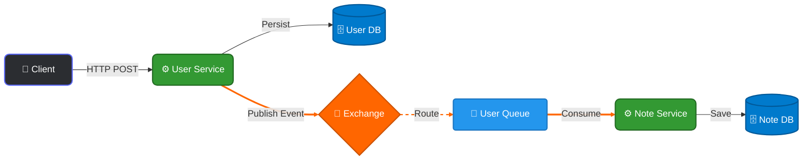

# Folder Structure of Even Driven Architecture

<h3>🛠 Tech Stack ⚛</h3>

---

<p align="center">
  
  
  
  
  
  
  
  
  
  
  
  
  
  
</p>

---

<div align="center">
  <h2>Micro Service Architecture</h2>
</div>

A scalable, event-driven microservices architecture built with **Node.js** and **TypeScript**. This project demonstrates asynchronous communication between services using **RabbitMQ** to decouple business logic and ensure high availability.

---

## 🏗 System Architecture

The application is split into distinct domain services. Communication is handled via REST APIs for synchronous operations and RabbitMQ for asynchronous event propagation.

### The Flow

1.  **User Service**: Handles user authentication and management. When a user state changes (e.g., created, updated), it **publishes** an event to the message broker.
2.  **RabbitMQ**: Acts as the message broker, routing events to the appropriate queues.
3.  **Note Service**: Manages user notes. It **consumes** user events to maintain data consistency (e.g., creating a default welcome note when a new user registers).



```
app/.
├──  api-gateway
│   ├── Dockerfile
│   ├── package.json
│   ├── package-lock.json
│   ├── src
│   │   ├── app.ts
│   │   ├── middleware
│   │   │   └── auth.middleware.ts
│   │   └── routes
│   │       ├── note.proxy.ts
│   │       └── user.proxy.ts
│   └── tsconfig.json
├── DATABASE.md
├── docker-compose.yml
├── note-service
│   ├── Dockerfile
│   ├── package.json
│   ├── package-lock.json
│   ├── prisma
│   │   └── schema.prisma
│   ├── src
│   │   ├── app.ts
│   │   ├── config
│   │   │   ├── env.ts
│   │   │   └── rabbitmq.ts
│   │   ├── events
│   │   │   ├── consumers
│   │   │   │   └── user.consumer.ts
│   │   │   └── handlers
│   │   │       └── user.event.handler.ts
│   │   ├── modules
│   │   │   └── note
│   │   │       ├── note.controller.ts
│   │   │       ├── note.model.ts
│   │   │       ├── note.routes.ts
│   │   │       └── note.service.ts
│   │   ├── server.ts
│   │   └── shared
│   │       ├── database.ts
│   │       └── logger.ts
│   └── tsconfig.json
├── README.md
└── user-service
    ├── Dockerfile
    ├── package.json
    ├── package-lock.json
    ├── prisma
    │   └── schema.prisma
    ├── src
    │   ├── app.ts
    │   ├── config
    │   │   ├── env.ts
    │   │   └── rabbitmq.ts
    │   ├── events
    │   │   ├── publishers
    │   │   │   └── user.publisher.ts
    │   │   └── types
    │   │       └── user.events.types.ts
    │   ├── modules
    │   │   └── user
    │   │       ├── user.controller.ts
    │   │       ├── user.events.ts
    │   │       ├── user.model.ts
    │   │       ├── user.routes.ts
    │   │       └── user.service.ts
    │   ├── server.ts
    │   └── shared
    │       ├── database.ts
    │       └── logger.ts
    └── tsconfig.json


```

---

## 🚧 Next Steps

The following steps are needed to complete the project end-to-end:

1. **Fill in service code** — implement `server.ts`, `app.ts`, routes, controllers, and services in both `user-service` and `note-service`
2. **Set up RabbitMQ connection** — configure `config/rabbitmq.ts` in each service (connect, declare exchange & queues)
3. **Publish events** — in `user-service`, after a user is created/updated, publish a `user.created` event to RabbitMQ
4. **Consume events** — in `note-service`, listen for `user.created`, then create a `SyncedUser` record + a default welcome `Note`
5. **Run migrations** — once Postgres is up via Docker, run `npm run db:migrate` in each service to create the tables
6. **Wire up the API Gateway** — `api-gateway` proxies requests to the correct service
7. **Run & test** — `docker compose up --build`, then hit the endpoints to verify the full event-driven flow

> Build order: **DB → RabbitMQ config → user-service → note-service → gateway → test**

---
